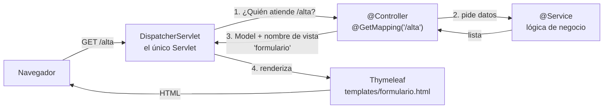

# De Servlet/JSP a Spring MVC

> Spring Boot **no sustituye** a Jakarta EE: lo construye encima. Todo lo que visteis en la UD1 sigue ahí, pero ahora lo hace Spring por vosotros.

## 1. La idea clave: un único Servlet (Front Controller)

En la UD1 teníamos **un Servlet por URL**. En Spring MVC hay **un solo Servlet**, el `DispatcherServlet`, que recibe *todas* las peticiones y las reparte entre nuestros controladores.



El flujo **request → controlador → modelo → vista → response** es el mismo de la UD1. Lo que cambia es quién escribe cada parte:

| Tarea | UD1: lo hacías tú | UD2: lo hace Spring |
|---|---|---|
| Arrancar el servidor | Tomcat instalado + desplegar `.war` | Tomcat **embebido**: ejecutar `main()` |
| Mapear URL → código | `@WebServlet("/alta")` | `DispatcherServlet` + `@GetMapping("/alta")` |
| Distinguir GET / POST | `doGet()` / `doPost()` | `@GetMapping` / `@PostMapping` |
| Leer parámetros y convertir tipos | `request.getParameter()` + `Integer.parseInt()` | `@RequestParam int edad` |
| Pasar datos a la vista | `request.setAttribute()` | `model.addAttribute()` |
| Ir a la vista | `getRequestDispatcher(...).forward(...)` | `return "nombreVista";` |
| Crear objetos de servicio | `new`, métodos `static` | `@Service` + inyección por constructor |
| Errores | `try/catch` en cada Servlet | `@ExceptionHandler` en un único sitio |
| Dependencias y versiones | Cada una en el `pom.xml` con su versión | *Starters* + `spring-boot-starter-parent` |

## 2. ¿Qué es Spring Boot y qué aporta sobre Spring?

| | Spring Framework | Spring Boot |
|---|---|---|
| Qué es | El framework: contenedor IoC, MVC, datos, seguridad… | Una capa encima para **arrancar rápido** |
| Configuración | Manual (XML o clases `@Configuration`) | **Autoconfiguración**: si ve Thymeleaf en el classpath, lo configura |
| Servidor | Externo | Embebido (Tomcat por defecto) |
| Dependencias | Una a una, con versiones | *Starters* (`spring-boot-starter-webmvc`, `-thymeleaf`…) |

> **Convención sobre configuración:** si sigues la estructura esperada (`templates/`, `static/`, `application.properties`), no tienes que configurar casi nada.

## 3. Crear el proyecto: Spring Initializr

Desde IntelliJ (**New Project → Spring Boot**) o en [start.spring.io](https://start.spring.io).

| Dependencia en Initializr | Starter en el `pom.xml` | Para qué |
|---|---|---|
| Spring Web | `spring-boot-starter-webmvc` | Spring MVC + Tomcat embebido |
| Thymeleaf | `spring-boot-starter-thymeleaf` | Motor de plantillas (sustituye a JSP) |
| Spring Boot DevTools | `spring-boot-devtools` | Reinicio automático al recompilar |

> En Spring Boot 4 el starter de Spring MVC se llama `spring-boot-starter-webmvc` (antes `spring-boot-starter-web`). En tutoriales anteriores a 2026 veréis el nombre antiguo.

## 4. Dónde va cada cosa

| UD1 (`war`) | UD2 (`jar`) | ¿Accesible por URL? |
|---|---|---|
| `src/main/webapp/*.jsp` | `src/main/resources/templates/*.html` | No: solo a través de un controlador |
| `src/main/webapp/css/` | `src/main/resources/static/css/` | **Sí**: `/css/estilos.css` |
| `src/main/webapp/WEB-INF/datos/` | `src/main/resources/datos/` | No |
| `WEB-INF/web.xml` | `application.properties` + anotaciones | — |

## 5. Thymeleaf en 6 atributos (vs JSP/JSTL)

| Necesito… | JSP + JSTL | Thymeleaf |
|---|---|---|
| Pintar un valor | `${nombre}` | `<span th:text="${nombre}">x</span>` |
| Rellenar un input | `value="${param.email}"` | `th:value="${email}"` |
| Condicional | `<c:if test="${...}">` | `th:if="${...}"` |
| Bucle | `<c:forEach var="t" items="${lista}">` | `th:each="t : ${lista}"` |
| URL de la app | `${pageContext.request.contextPath}/css/x.css` | `th:href="@{/css/x.css}"` |
| Opción seleccionada | `${t == param.t ? 'selected' : ''}` | `th:selected="${t == tecnologia}"` |

Dos ventajas importantes frente a JSP:

- **Plantillas naturales:** un `.html` de Thymeleaf se abre en el navegador sin servidor (los `th:*` se ignoran y se ven los textos de ejemplo). Útil para trabajar con diseño.
- **Escapado por defecto:** `th:text` escapa el HTML (protección frente a XSS). En JSP, `${nombre}` escrito directamente en la página **no** escapa.

## 6. Anotaciones de hoy

| Anotación | Dónde | Para qué |
|---|---|---|
| `@SpringBootApplication` | Clase principal | Activa autoconfiguración y escaneo de componentes |
| `@Controller` | Clase | Controlador MVC: sus métodos devuelven **nombres de vista** |
| `@GetMapping` / `@PostMapping` | Método | Asocia URL + método HTTP |
| `@RequestParam` | Parámetro | Lee un parámetro de la petición (y convierte el tipo) |
| `@Service` | Clase | Lógica de negocio; Spring crea un único objeto y lo inyecta |
| `@ExceptionHandler` | Método | Captura una excepción y decide qué vista mostrar |

> **`@Controller` vs `@RestController`:** `@Controller` devuelve una **vista** (HTML generado en el servidor). `@RestController` devuelve **datos** (JSON). En esta unidad trabajamos con `@Controller`; las API REST son la UD3.

## 7. Separar presentación y lógica

```
controller/   →  recibe la petición, llama al servicio, elige la vista     (PRESENTACIÓN)
service/      →  reglas de negocio: validar, calcular, decidir             (LÓGICA)
repository/   →  acceso a datos: fichero, JDBC, BD                         (DATOS)
templates/    →  solo pinta lo que hay en el Model                         (VISTA)
```

**Regla práctica:** si en un controlador ves un `BufferedReader`, un `Connection` o un cálculo de negocio, está en la capa equivocada.

## Referencias

- [Spring Initializr](https://start.spring.io)
- [Spring Web MVC: DispatcherServlet](https://docs.spring.io/spring-framework/reference/web/webmvc/mvc-servlet.html)
- [Tutorial: Using Thymeleaf](https://www.thymeleaf.org/doc/tutorials/3.1/usingthymeleaf.html)
- [Guía oficial: Serving Web Content with Spring MVC](https://spring.io/guides/gs/serving-web-content)
