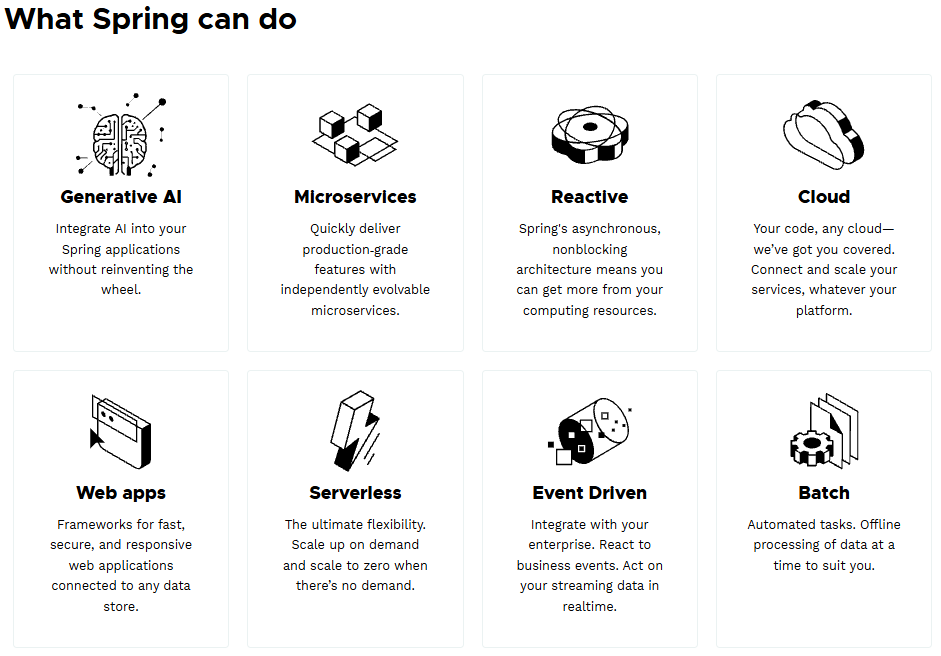

# UD2. Páginas dinámicas, sesiones y arquitectura MVC


https://spring.io/

En esta unidad damos el salto de Servlet/JSP a **Spring Boot + Spring MVC + Thymeleaf**. Empezamos resolviendo un problema que ya conocéis con otra herramienta y terminamos con una aplicación por capas, con formularios validados, base de datos H2 y autenticación con Spring Security.

## Hoja de ruta

| Bloque | Contenido |
|---|---|
| 1 | Primer proyecto Spring Boot con Thymeleaf (controladores, modelo, vistas, fragmentos) |
| 2 | Formularios dinámicos y validación (`@Valid`) |
| 3 | Arquitectura por capas, inyección por constructor, SOLID y patrones de diseño |
| 4 | Repositorio con JDBC y H2, programando contra la interfaz |
| 5 | Configuración (`application.properties`, perfiles) |
| 6 | Sesiones y autenticación con Spring Security (formLogin), usuarios y roles en H2 |
| 7 | Pruebas, depuración y uso crítico de la IA como herramienta |

## Conceptos teóricos

- [De Servlet/JSP a Spring MVC](./conceptos/de-servlet-a-spring-mvc.md)

### Spring Boot ¿Qué es y cómo funciona?

Spring Boot es una extensión del framework Spring cuya finalidad es simplificar la creación y configuración inicial de aplicaciones.

- **Autoconfiguración:** detecta las librerías del proyecto y las configura con valores por defecto razonables.
- **Starters:** una dependencia agrupa todo lo necesario (`spring-boot-starter-webmvc`, `spring-boot-starter-thymeleaf`…) con versiones compatibles entre sí.
- **Servidor embebido:** la aplicación es un `.jar` con Tomcat dentro. Se arranca con `main()`; no hay que desplegar un `.war`.

### Spring Platform

Conjunto de proyectos open source en Java para agilizar el desarrollo de aplicaciones (Spring Framework, Spring Data, Spring Security…).



### Estructura básica de un proyecto Spring Boot

```
src/
 ├── main/
 │    ├── java/
 │    │    └── es.daw.miapp/               // Paquete base de la aplicación
 │    │         ├── MiAppApplication.java  // Clase principal con @SpringBootApplication
 │    │         ├── controller/            // Controladores (@Controller: vistas / @RestController: JSON)
 │    │         ├── service/               // Lógica de negocio
 │    │         ├── repository/            // Acceso a datos
 │    │         ├── model/                 // Clases del modelo de datos
 │    │         ├── exception/             // Excepciones propias
 │    │         └── config/                // Configuración personalizada
 │    └── resources/
 │         ├── application.properties      // Configuración principal de Spring Boot
 │         ├── static/                     // Estáticos servidos tal cual (CSS, JS, imágenes)
 │         ├── templates/                  // Plantillas Thymeleaf
 │         └── db/                         // Scripts SQL (opcional)
 └── test/
      └── java/                            // Pruebas unitarias y de integración
```

### Principales anotaciones

| Anotación | Rol en la aplicación | Capa |
|---|---|---|
| `@SpringBootApplication` | Clase principal de inicio | Configuración |
| `@Controller` | Controlador MVC (devuelve vistas) | Presentación |
| `@RestController` | Controlador REST (devuelve JSON) — UD3 | Presentación |
| `@GetMapping` / `@PostMapping` | Asocia URL + método HTTP a un método | Presentación |
| `@RequestParam` | Lee un parámetro de la petición | Presentación |
| `@Service` | Lógica de negocio | Servicio |
| `@Repository` | Acceso a datos | Persistencia |
| `@Configuration` | Define beans / configuración | Configuración |

> En esta unidad trabajamos con **`@Controller`**: el servidor genera el HTML (MPA). Los **`@RestController`** devuelven datos y los veremos en la UD3 (API REST).

## Práctica

- [Ejercicios](./ejercicios/readme.md)
  - [1. Alta de usuario: de Servlet/JSP a Spring MVC](./ejercicios/alta-usuario-spring.md)

## Tutoriales de apoyo

- [IntelliJ: tu primera aplicación Spring](https://www.jetbrains.com/help/idea/your-first-spring-application.html)
- [IntelliJ: Spring support tutorial](https://www.jetbrains.com/help/idea/spring-support-tutorial.html)
- [Spring: Serving Web Content with Spring MVC](https://spring.io/guides/gs/serving-web-content)

## Webs de referencia

- https://spring.io/
- https://start.spring.io/
- https://docs.spring.io/spring-framework/reference/web/webmvc.html
- https://www.thymeleaf.org/documentation.html
- https://www.jetbrains.com/idea/spring/

___

## Página principal del curso
[VOLVER PÁGINA PRINCIPAL](https://github.com/profeMelola/DWES-00-2026-27)

## Licencia

<a rel="license" href="http://creativecommons.org/licenses/by-nc-sa/4.0/"></a><br />Este obra está bajo una <a rel="license" href="http://creativecommons.org/licenses/by-nc-sa/4.0/">licencia de Creative Commons Reconocimiento-NoComercial-CompartirIgual 4.0 Internacional</a>.
